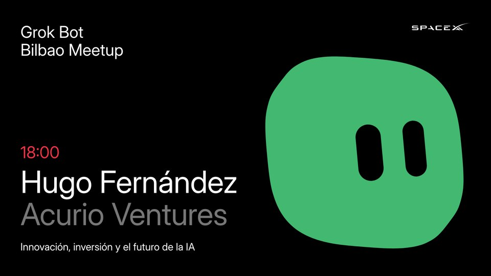
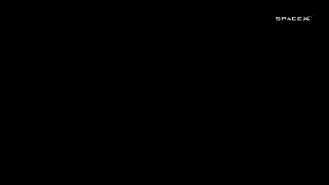
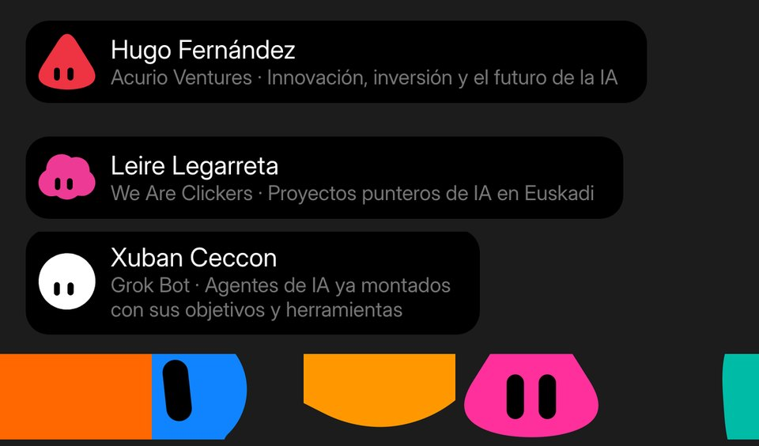
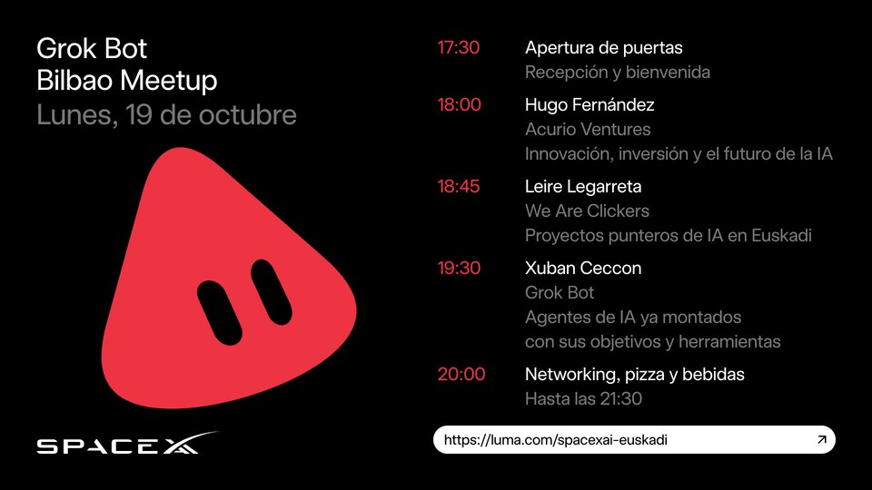
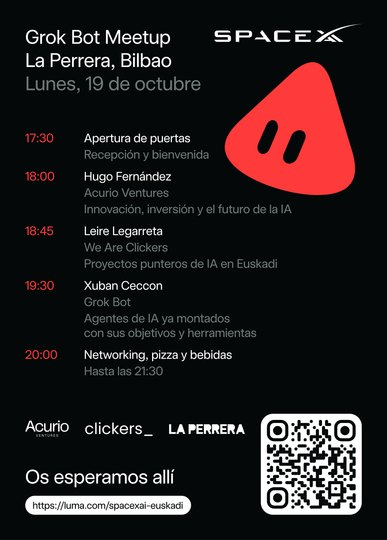
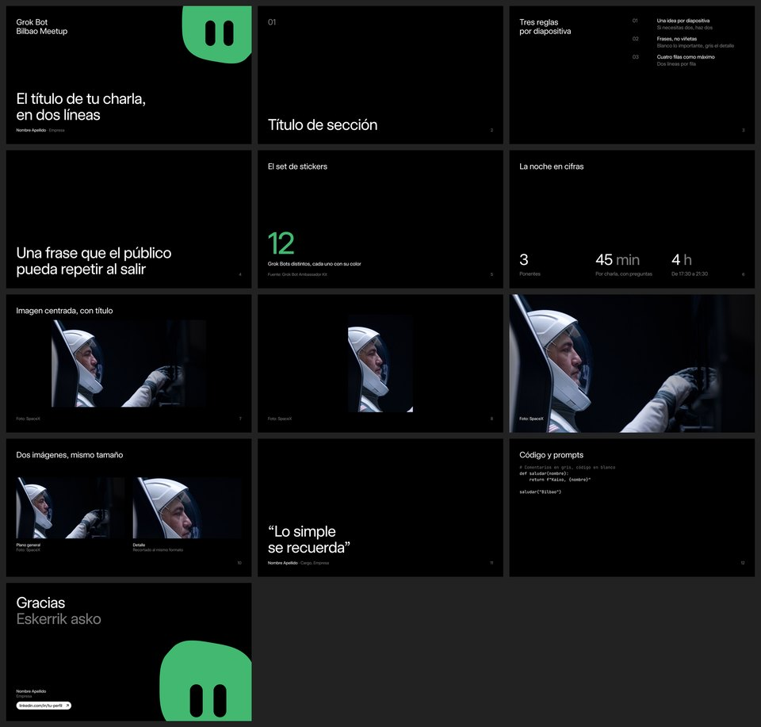

# Grok Bot Bilbao Meetup: the brand package as code

Everything the designer made for the **Grok Bot Bilbao Meetup, Monday 19 October 2026, La Perrera, Bilbao**, rebuilt as code we own: live screens, their videos, stream overlays, social posts, the poster and the speaker slides.

<table>
<tr>
<td width="50%" valign="top">
<a href="reference/live-screens/"></a>
<p><b>1. Live screens</b><br>
26 stills, 1920 × 1080 PNG: 13 screens, each clean and with the SpaceXAI logo.<br>
Ours: all 13 done. Every bot is fitted to the designer's still (overlap 0.97 to 0.999).<br>
<a href="https://github.com/EHxuban11/bilbao-meetup-brand-assets/releases/latest/download/grokbot-bilbao-stills.zip">Download (zip)</a> · <a href="reference/live-screens/stills/">Designer's original</a> · <a href="src/scenes/live.mjs">Source</a></p>
</td>
<td width="50%" valign="top">
<a href="reference/live-screens/video/"></a>
<p><b>2. Screen videos</b><br>
Per screen: in, loop, out and full clips, H.264, 1080p, 30 fps, plus the 51 s preview reel.<br>
Ours: done. Where the designer's clips exist, the bots differ from his by less than 1 in 255, frame by frame.<br>
<a href="https://github.com/EHxuban11/bilbao-meetup-brand-assets/releases/latest/download/grokbot-bilbao-screen-videos.zip">Download (zip)</a> · <a href="reference/live-screens/video/">Designer's original</a> · <a href="src/render.mjs">Source</a></p>
</td>
</tr>
<tr>
<td width="50%" valign="top">
<a href="reference/live-screens/stills/"></a>
<p><b>3. Stream overlays</b><br>
3 lower thirds, 5 stingers and the logo bug, as ProRes 4444 .mov and VP9 .webm with alpha.<br>
Ours: done. The lower third and stingers 1 and 4 match his clips almost exactly.<br>
<a href="https://github.com/EHxuban11/bilbao-meetup-brand-assets/releases/latest/download/grokbot-bilbao-overlays.zip">Download (zip)</a> · <a href="reference/live-screens/stills/">Designer's original</a> · <a href="docs/motion-spec.md">Motion spec</a></p>
</td>
<td width="50%" valign="top">
<a href="reference/social/"></a>
<p><b>4. Social posts</b><br>
The agenda as horizontal 1920 × 1080 and story 1080 × 1920, at 1x and @2x, plus five partner posts.<br>
Ours: done. Only the font differs from the originals.<br>
<a href="https://github.com/EHxuban11/bilbao-meetup-brand-assets/releases/latest/download/grokbot-bilbao-social.zip">Download (zip)</a> · <a href="reference/social/">Designer's original</a> · <a href="src/scenes/social.mjs">Source</a></p>
</td>
</tr>
<tr>
<td width="50%" valign="top">
<a href="reference/print/"></a>
<p><b>5. Poster</b><br>
50 × 70 cm PDF: 3 mm bleed, rich black C60 M40 Y40 K100, with and without crop marks.<br>
Ours: done, with the designer's ink values and the same QR code. Only the font differs.<br>
<a href="https://github.com/EHxuban11/bilbao-meetup-brand-assets/releases/latest/download/grokbot-bilbao-poster.zip">Download (zip)</a> · <a href="reference/print/">Designer's original</a> · <a href="src/scenes/print.mjs">Source</a></p>
</td>
<td width="50%" valign="top">
<a href="reference/speaker-deck/"></a>
<p><b>6. Speaker slides</b><br>
A PowerPoint template per speaker, 13 layouts, the speaker kits, and the builder that turns a talk.json into a deck.<br>
Ours: done. The generated templates are identical to the designer's, part for part; the designer's own build.py runs on them unchanged.<br>
<a href="https://github.com/EHxuban11/bilbao-meetup-brand-assets/releases/latest/download/grokbot-bilbao-slides.zip">Download (zip)</a> · <a href="reference/speaker-deck/">Designer's original</a> · <a href="docs/deck.md">How to use</a></p>
</td>
</tr>
</table>

**Get them.** Under each card:

- Download (zip): our files, from the [latest release](https://github.com/EHxuban11/bilbao-meetup-brand-assets/releases/latest). They were rendered with the stand-in font; see [The font](#open-questions).
- Designer's original: the files Pablo delivered, kept untouched as the target.
- Source: the code that makes the card.

**Change them.** Content lives in `config/event.js`: names, talk titles, times, the date, the link, each speaker's bot and colour, the partner logos. Edit it, then:

```bash
npm install && npx playwright install chromium     # once
npm run stills                                     # every still        -> out/live-screens/stills/
npm run video                                      # every clip         -> out/live-screens/video/
npm run compare                                    # ours against the designer's -> out/compare/
npm run social                                     # every social post  -> out/social/
npm run print                                      # the poster PDFs    -> out/print/
npm run deck                                       # slide templates and speaker kits -> out/deck/
npm run reel                                       # the preview reel, from the rendered clips
npm run verify                                     # our videos against the designer's clips
npm run build && npm run package                   # everything, then the release zips -> dist/
```

To build a speaker's actual deck from their content: `node src/deck/build.mjs talk.json --speaker hugo`. The format is in [docs/deck.md](docs/deck.md).

Every command takes a filter: `node src/render.mjs video speaker-hugo`, `node src/render.mjs stills logo`, `node src/render.mjs stills '!logo'`. One screen's four clips render in about 25 seconds; everything in about 8 minutes.

---

Working repo for the event's brand system. Original design: Pablo Gonzalez, delivered through Frame.io on 28 Sep 2026.

> **Status: v1.0 (28 Sep 2026). Every deliverable is rebuilt and checked against the originals.** The only thing between these files and the designer's is the font: buy the licence and re-render. What is decided is in the decisions log at the bottom.

## The problem

The designer delivers exports, not the files that make them. Changing a logo or moving an element means a message and about four hours of waiting. This repo turns the package into code, so a change takes minutes and doesn't depend on anyone.

## Principles

1. **Pixel-accurate against the designer's files.** `npm run compare` renders every still and diffs it against his PNG. Nothing counts as done until it matches.
2. **Content in one file.** `config/event.js` holds everything that changes between events. `config/theme.js` holds the design system: grid, type sizes, colours.
3. **One command rebuilds everything.** No hand edits to outputs.
4. **The designer's motion, not an imitation.** The bots move with tracks captured frame by frame from his videos.
5. **His files stay untouched** in `reference/`, as the target.
6. **Licensed things stay licensed.** The event font is never extracted from his PowerPoints.

## How close it is

Measured with `npm run compare` (stills) and `npm run verify` (videos): mean difference per pixel, on a 0 to 255 scale. The whole-frame numbers include the stand-in font; the bot numbers don't.

| Deliverable | Whole frame | Bot area | Notes |
| --- | --- | --- | --- |
| Speaker screens, in, loop, out | 1.5 to 5.1 | 0.2 to 0.6 | worst single frame 0.9 |
| Pre-show, in, loop, out | 0.6 to 1.7 | 0.3 to 0.6 | |
| Lower third (Leire), in, loop, out | 0.2 to 0.5 | 0.01 | |
| Stingers 1 and 4 | 0.2 to 0.4 | 0.2 to 0.4 | stingers 2, 3 and 5 were rebuilt from the 720p reel, no full clip to check against |
| Logo bug | 0.02 | | |
| Networking intro | 6.1 | 4.6 | the weakest: each bot runs the speaker motion at its own phase, fitted to the reel and the still, not captured frame by frame |
| Preview reel | 4.6 | | worst frame 41, the fast entry of stinger 5 |
| Stills (35 live, 9 social) | 0.02 to 5.5 | | text width only, except stingers 1 and 3 (only a sliver of the bot is visible) |

Screens whose clips weren't in the delivery (welcome, agenda, Q&A, thanks, be right back, networking loop and out) take their motion from the 720p reel; their text outs and the partner row timing on screen 22 follow the measured screens (marked "assumed" in `assets/motion/`).

## What the designer's files told us

| Finding | Evidence | What we did |
| --- | --- | --- |
| The PowerPoints were generated by code | PptxGenJS internals (`Text 1`, `image-7-1.jpg`) | Generate our templates with PptxGenJS too |
| The deck builder exists | The speaker kits contain `build.py`, `SKILL.md`, `LEEME.md` | Recovered them from the partial kit downloads into `reference/speaker-deck/ai-kit/` |
| Screens and videos are rendered by code | PNG and video metadata stripped; frame-perfect in, loop and out joins; balanced line breaks | Render with our own engine in headless Chrome |
| The poster was made in Illustrator | PDF creator Adobe Illustrator 30.8, UserUnit 10 (so 50 × 70 cm) | Build it from the same scene data; export CMYK with his exact ink values |
| Stills are frames of the loop | Loop frame 36 equals the speaker still (mean difference 0.34 out of 255); frame 276 equals the Q&A still | Stills and videos come from the same motion data |
| Layout follows a strict grid | Baselines at 148, 218, 288 (64 px) and 195, 321, 447 (120 px); bottom lines end at 980; bots fit an 800 × 780 box whose corner sits on the margins | Every element is placed by baseline, so the licensed font drops in without layout changes |

## Deliverables checklist

Status as of 28 Sep 2026.

| # | Deliverable | Format | Owner | Status |
| --- | --- | --- | --- | --- |
| 1 | Speaker screens, Hugo, Leire, Xuban, clean and logo | PNG; MP4 in, loop, out, full | Claude | Done |
| 2 | Q&A screens, same three | Same | Claude | Done |
| 3 | Pre-show, welcome, agenda, agenda with partners, thanks, be right back | Same | Claude | Done |
| 4 | Networking, six bots | Same | Claude | Done; motion modelled, not captured (see above) |
| 5 | Lower thirds, three | MOV and WebM with alpha | Claude | Done |
| 6 | Stingers, five | MOV and WebM with alpha | Claude | Done |
| 7 | Logo bug | MOV and WebM with alpha | Claude | Done |
| 8 | Preview reel, 51 s, clean and logo | MP4, 1080p and 720p | Claude | Done, same cuts as the designer's |
| 9 | Social: agenda, horizontal and story, 1x and @2x | PNG | Claude | Done |
| 10 | Social: partner posts, five | PNG | Claude | Done |
| 11 | Poster, with and without crop marks | PDF, CMYK | Claude | Done |
| 12 | Speaker slide templates, four, the kits, and the builder | PPTX; ZIP; `talk.json` | Claude | Done. Identical to the designer's templates after normalising the XML; his `build.py` gives the same deck and the same warnings as ours |
| 13 | Partner logos: Acurio Ventures, clickers_, La Perrera | SVG | Claude | Done, exact vectors taken from the poster PDF |
| 14 | Bot shapes: square, cloud, round, triangle, drop | SVG paths | Claude | Done |
| 15 | QR code to the registration page | SVG | Claude | Done: the same modules as the poster's, 0 pixels differ |
| 16 | Universal Sans Display Regular licence | Font file | Xuban | To buy |

## Open questions

- **The font.** Buy Universal Sans Display Regular from universalsans.com (Family Type). A Desktop licence covers rendering; check whether the stream or social use needs the Social or Broadcast licence.
- **The designer.** Not asking Pablo for the source now. Revisit if something can't be matched.
- **Where the repo lives.** Public, on Xuban's personal account. Move it to the organisers' GitHub?
- **"LINK INSTAGRAM".** The stories carry a pill with that text, a placeholder for Instagram's link sticker. Keep it as is?
- **The poster's link pill** reads `https://luma.com/spacexai-euskadi`, while `DESIGN.md` says to drop `https://`. Keep it as printed or follow the rule?

## Decisions log

- 2026-09-28: rebuild the package as code instead of asking the designer for his source files (Xuban).
- 2026-09-28: repo on Xuban's account, first private, then made public (Xuban); the designer's delivery kept untouched in `reference/`.
- 2026-09-28: render with a free stand-in font (Inter Display) until Universal Sans Display is licensed; never extract the copy embedded in the designer's PowerPoints.
- 2026-09-28: text is placed by baseline, so swapping the font changes no layout.
- 2026-09-28: bots move with motion captured from the designer's videos, not animated again by hand.
- 2026-09-28: the designer's deck builder (`build.py`, `SKILL.md`) recovered from the partial kit downloads; our deck builder reads the same `talk.json`.
- 2026-09-28: print colours use the designer's own CMYK values, read from his poster PDF.
- 2026-09-28: every bot on a still is placed by fitting its outline to the designer's image (`tools/fit-stills.mjs`); a screen's motion is anchored so its still frame lands exactly there.
- 2026-09-28: the poster keeps the designer's quirks: its own logo proportions and a 19 mm line under a wrapped talk title.
- 2026-09-28: every screen's motion, the lower thirds, the stingers and the logo bug are captured from the designer's clips, or from his 720p reel where no clip was delivered (`docs/motion-spec.md`).
- 2026-09-28: the preview reel reuses his cuts: the same 11 stinger transitions, and each screen starts 9 to 15 frames after the cut.
- 2026-09-28: the slide templates are generated with PptxGenJS plus the same fix-ups the designer applied, so his `build.py` and `SKILL.md` keep working on ours.

## Repo layout

- `config/`: `event.js` (content) and `theme.js` (grid, type, colours).
- `assets/bots/`: the bot outlines and their neutral faces. `assets/motion/`: motion tracks per screen. `assets/logos/`: SpaceX, SpaceXAI and partner logos.
- `src/deck/`: the slide templates, the talk builder and the speaker kits; `verify/` checks them against the designer's files.
- `src/engine/`: draws a scene as SVG and poses it at any frame. `src/scenes/`: one file per family of deliverables. `src/render.mjs`: stills, videos and comparisons. `src/lib/`: shared loaders, PDF export, QR code.
- `tools/`: what was used to rebuild the system (measuring baselines, tracing bots, motion capture, comparing videos). Reuse them when the designer sends something new.
- `docs/`: specs measured from the originals (layout, motion, deck) and the README previews.
- `fonts/`: the licensed font goes here (not committed); `fonts/stand-in/` has the free fallback.
- `reference/`: the designer's delivery.
- `out/`: generated files (not committed).

## Updating after a change

1. Edit `config/event.js` (or `config/theme.js`).
2. `npm run compare` to make sure nothing drifted from the grid.
3. `npm run stills` and `npm run video`, then check `out/`.
4. `npm run build && npm run package`, then publish a release so the download links above serve the new files:
   `gh release create vYYYY-MM-DD dist/*.zip --title "Brand package, D Month YYYY"`.
